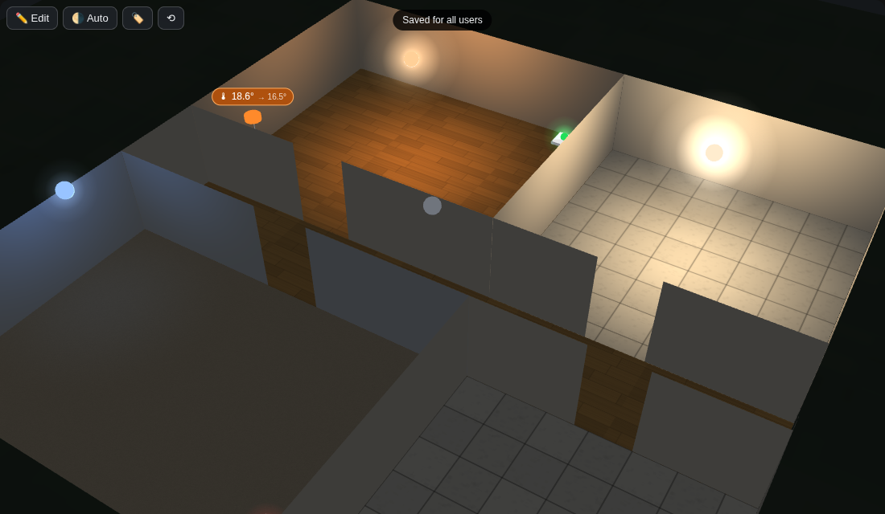
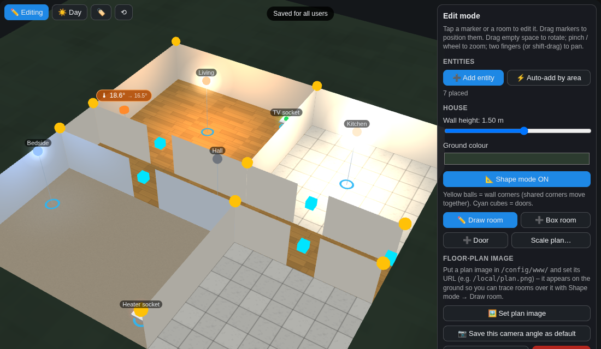

# House 3D Card

[](https://hacs.xyz)
[](https://github.com/markrgriffin/lovelace-house-3d-card/releases)


A rotatable 3D mimic of your house for Home Assistant dashboards. Lights glow in their real colour and brightness, sockets show a red/green LED, thermostats show current → target temperature, and everything is placed by dragging it around the 3D model — no YAML positioning.



## Features

- **Rotate, zoom and pan** by dragging (mouse or touch, pinch to zoom, two fingers to pan). Near walls hide themselves so you can always see in.
- **Lights** light up their own room in the entity's colour, and the pool of light shrinks as the light dims. Light never bleeds through walls.
- **Sockets / switches** show as a wall plate with a green (on) or red (off) LED.
- **Climate** entities show a chip with current → target; it turns orange while heating. Tap for a −/+ target popup and HVAC modes.
- **Tap** a light or socket to toggle it. **Long-press** for the Home Assistant more-info dialog (dimming, colour, history).
- **Day / night**: ambient light follows `sun.sun`, or force day/night from the toolbar.
- **Edit mode** (admins): drag entities into position, set their height and light reach; per-room floor texture (wood, carpet, tile) and colour, wall colour, wall height; move wall corners and doors; draw new rooms.
- **Trace your own floor plan**: show a scanned/drawn plan image on the ground and tap out each room's corners over it.
- **Layout saved in Home Assistant**, shared by all users and devices. Export/import as JSON for backup.
- Single file, no CDN, bundles [three.js](https://threejs.org) — works offline and on the companion app.



## Installation

### HACS (recommended)

1. HACS → ⋮ → **Custom repositories** → add `https://github.com/markrgriffin/lovelace-house-3d-card`, category **Dashboard**.
2. Search for **House 3D Card** and download it.
3. HACS registers the resource automatically. If you manage resources yourself, add `/hacsfiles/lovelace-house-3d-card/house-3d-card.js` as a *JavaScript module*.

### Manual

Copy `house-3d-card.js` from the [latest release](https://github.com/markrgriffin/lovelace-house-3d-card/releases) to `/config/www/house-3d-card.js` and add `/local/house-3d-card.js` as a JavaScript module resource.

## Usage

Best in a full-height **panel** view:

```yaml
type: panel
title: House
path: house-3d
cards:
  - type: custom:house-3d-card
```

| Option | Default | Description |
|---|---|---|
| `height` | `calc(100vh - 130px)` | CSS height of the card. |
| `storage_key` | `default` | Which saved layout to use. Use different keys for different cards (e.g. one per floor). |
| `allow_edit` | `true` | Show the Edit button to admins. |
| `ambient` | `auto` | `auto` (follows `sun.sun`), `day`, `night`, or a number 0.05–1. |
| `background` | `#14171a` | Card background colour. |
| `marker_scale` | `1` | Multiply marker size. |
| `plan` | built-in starter house | A full layout object used when nothing has been saved yet (see *Export / import*). |
| `entities` | — | Entity IDs to pre-place when nothing has been saved yet. |

## Building your house

The card starts with a small generic house. Turn it into yours:

1. **Get a plan image.** A photo of the architect's drawing, a screenshot of a floor-planner, or a sketch — anything. Put it in `/config/www/` (e.g. `/config/www/plan.png`).
2. Tap **✏️ Edit → Set plan image**, enter `/local/plan.png` and roughly how wide the image is in metres. Fine-tune width, offset and rotation with the sliders until it sits where you want it.
3. Tap **Shape mode → Draw room**, then tap each corner of a room in order. Corners snap to existing corners so shared walls line up. Tap the first corner again (or *Finish room*) to close it. Repeat for every room. Delete the starter rooms you don't need (tap a room → Delete room).
4. Add **doors** (+ Door, then drag the cyan cube onto a wall) and set each room's **name, HA areas, floor and wall colour**.
5. Tap **⚡ Auto-add by area** to drop every light and thermostat into the room whose *HA areas* field matches its Home Assistant area, then drag them into their real positions. Add sockets with **➕ Add entity**.
6. **Save.** Untick *Show image outside edit mode* if you don't want the plan visible normally.

Tips: wall height around 1.5 m gives the best view into rooms. The *Scale plan…* button rescales everything at once if you get the metres wrong. *Save this camera angle as default* remembers your favourite view.

## Export / import

Edit → *Export / import* shows the whole layout as JSON. Keep a copy as a backup, or paste it into the `plan:` option of the card config so a fresh install starts from it.

## Storage

The layout is stored with Home Assistant's frontend system storage (`frontend/set_system_data`, HA 2024.6+), so every user and device sees the same house. On older cores it falls back to per-user storage and the save toast tells you which one was used.

## Browser support

Any browser with WebGL (all current desktop and mobile browsers, and the Home Assistant companion apps). The Home Assistant Cast / Fully-Kiosk on low-end tablets works but rotates less smoothly.

## Development

```
npm ci
npm run build      # → dist/house-3d-card.js
```

`src/house-3d-card.js` is plain ES2020 with no framework; esbuild bundles three.js into the single distributable.

## Licence

MIT. Bundles three.js (MIT).
